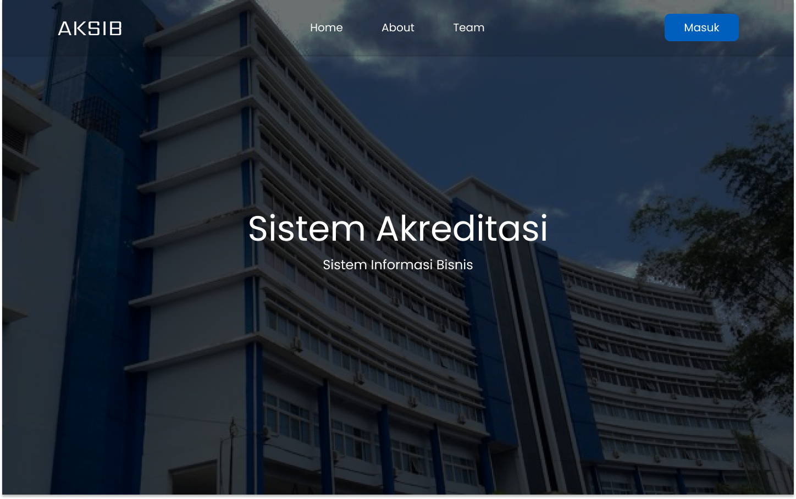

# 🎓 Sistem Akreditasi D-IV SIB

Aplikasi berbasis Laravel untuk mengelola dan memvalidasi data akreditasi program studi D-IV Sistem Informasi Bisnis (SIB), termasuk manajemen dokumen PPEPP (Penetapan, Pelaksanaan, Evaluasi, Pengendalian, Peningkatan) serta proses validasi dari kajur dan direktur.

---

## 📸 Screenshot

### 📌 Home Sistem

### 📌 Form Input Kriteria

---

## 🚀 Fitur Utama

- Manajemen Kriteria 1–9 untuk proses akreditasi  
- Pengisian dokumen PPEPP lengkap dengan upload gambar/file pendukung  
- Validasi berjenjang: Kajur → Direktur  
- Export PDF per kriteria & merge otomatis  
- TinyMCE Editor + Upload Gambar  
- Autentikasi terpisah: Dosen & Users  

---